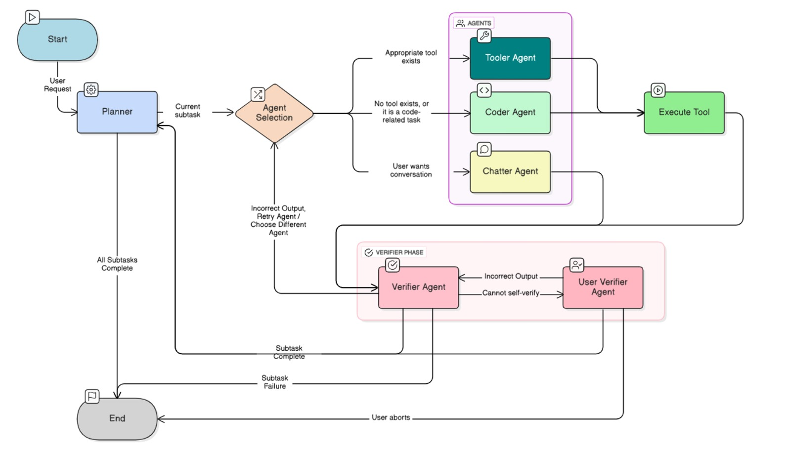

# Agentic System Interactions with AI

A local multi-agent system designed to automate tasks securely on a user’s machine without exposing private data.  
This project integrates a Vite-React frontend with a FastAPI backend that orchestrates LangGraph-based intelligent agents capable of planning, executing, and verifying tasks in real time.

Developed as a final-year Capstone project at NMIMS, this repository also serves as the implementation source for the accompanying research paper of the same name.

## 🧩 Overview

**Goal:**  
To develop a local agent system that automates actions on the system using existing tools or by coding new tools in Python. The design ensures privacy — all reasoning and execution happen locally without sending data to external servers.

**Key Features**

- Five specialized agents coordinated through LangGraph
- Real-time streaming of reasoning steps to frontend
- Tool-based and code-generation capabilities
- Local-only execution using Microsoft Phi-4 Mini model
- Modular FastAPI backend and React frontend

---

## 🏗️ System Architecture

```markdown

```

---

## ⚙️ Tech Stack

| Component       | Technology               |
| --------------- | ------------------------ |
| Frontend        | React (Vite)             |
| Backend         | FastAPI                  |
| Agent Framework | LangGraph                |
| Model           | Microsoft Phi-4 Mini     |
| Language        | Python                   |
| Communication   | Server-Sent Events (SSE) |

---

## 🤖 Agent Descriptions

### 1. **Planner Agent**

Breaks down the main user query into structured subtasks.
It also assigns the most appropriate executor (Chatter, Tooler, or Coder) for each subtask based on context and task type.

### 2. **Chatter Agent**

Generates a conversational or explanatory message for the current subtask.
Used when a natural-language response is required or when direct action isn’t needed.

### 3. **Tooler Agent**

Has access to all tools **except** the `run_python` tool.
It selects and executes the most relevant tool for the subtask at hand.

### 4. **Coder Agent**

Responsible for coding new tools or scripts in Python.
It exclusively uses the `run_python` tool to execute generated Python code that fulfills the subtask.

### 5. **Verifier Agent**

Evaluates the output from Chatter, Tooler, or Coder agents.
It can:

- Retry the same agent
- Redirect to a different agent
- Declare success or failure
- Request help from the user if context is insufficient

### 6. **User Verifier**

Pauses execution to seek human input when the Verifier Agent cannot resolve a subtask autonomously.
Once the user provides feedback, execution resumes from the same point.

---

## 🚀 Setup & Installation

### 1. Clone the Repository

```bash
git clone https://github.com/<your-username>/capstone-agentic-system-interactions-with-ai.git
cd capstone-agentic-system-interactions-with-ai
```

### 2. Backend Setup

```bash
cd app
Set-ExecutionPolicy -Scope Process -ExecutionPolicy Bypass
python -m venv venv
.venv/Scripts/Activate.ps1
pip install -r requirements.txt
```

Run the backend using **Uvicorn**:

```bash
uvicorn app.main:app --host 0.0.0.0 --port 8000 --reload
```

### 3. Frontend Setup

```bash
cd frontend
npm install
npm run dev
```

Frontend: [http://localhost:5173](http://localhost:5173)
Backend: [http://localhost:8000](http://localhost:8000)

---

## 🧠 Agent Workflow

1. **Planner Agent** decomposes the user query into subtasks.
2. **Assigned executor (Chatter, Tooler, or Coder)** handles each subtask.
3. **Verifier Agent** checks the results. If unresolved, it may request user input via the **User Verifier**.
4. **FastAPI backend** streams intermediate states and results to the frontend using Server-Sent Events.

---

## 📡 API Endpoints

| Endpoint    | Method | Description                                                                        |
| ----------- | ------ | ---------------------------------------------------------------------------------- |
| `/`         | GET    | Health check for backend availability                                              |
| `/query`    | POST   | Send an input query to the agentic system; receives streamed reasoning and results |
| `/continue` | POST   | Continue execution after user-verifier input                                       |
| `/startup`  | POST   | Refreshes or initializes tool embeddings                                           |

**Example Request:**
`POST /query`

```json
{
  "input": "Plan and write a Python script to clean CSV files in a folder."
}
```

---

## 👨‍💻 Development Team

- **Aadee Sawarkar**
- **Vikramaditya Sharma**
- **Aryan Mashru**
- **Joshua Ferreira**

---

## 🪪 License

Educational and research use only.
Reuse is permitted with credit to the authors.

---

## 🧭 Future Enhancements

- Persistent memory and pause-resume continuation
- Improved frontend UI for live streaming
- Multimodal input support (text, image, audio)
